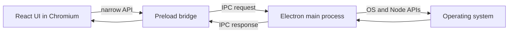

# System Monitor

A desktop system-monitoring dashboard built as a learning project with Electron, React, TypeScript, and Vite. The project is intended to explore how an Electron app connects its native desktop process to a web-based interface running inside Chromium.

> **Current status:** The dashboard is a UI prototype. CPU, memory, process, network, and performance readings are sample values in the renderer; the app does not yet collect live operating-system metrics.

## What You Can Explore

- A React dashboard with overview, processes, and performance pages.
- Search through the sample process list.
- Switch between light and dark palettes, or customize page background, text, heading, and sidebar colors. The selected theme is saved in browser local storage.
- See how Electron Forge and its Vite plugin build the main, preload, and renderer parts of one desktop app.

## Electron, Chromium, and V8

Electron combines Chromium with Node.js. V8 is the JavaScript engine used by both runtimes, but the environments around it are different:

- **Main process:** `src/main.ts` runs in Electron's Node.js-enabled main process. It creates and manages desktop windows and can access Electron and Node APIs.
- **Renderer process:** `src/renderer.tsx` mounts the React app inside a Chromium page. Chromium provides the DOM and rendering engine; V8 executes the page's JavaScript. The renderer should be treated like a web page, not given unrestricted Node.js access.
- **Preload script:** `src/preload.ts` is associated with the window through the `preload` setting in `src/main.ts`. It is currently a placeholder. It is the appropriate place to expose a small, deliberate API to the renderer.
- **IPC:** For live system data, the renderer should request specific operations through an API exposed by preload. Preload can forward validated requests to the main process using Electron IPC; the main process can collect system data and return typed results. Avoid exposing all of `ipcRenderer` or enabling Node integration in the renderer.



V8 executes JavaScript; it does not draw the interface or provide the browser DOM. In the renderer, Chromium's Blink engine handles the DOM and layout, and Chromium's rendering pipeline paints the result to the window.

## Requirements

- Node.js compatible with the installed Electron Forge and Vite versions.
- pnpm.

## Run Locally

From this directory:

```sh
pnpm install
pnpm start
```

Electron Forge starts the Vite development setup and opens the desktop window. The current main process also opens Chromium DevTools when it creates the window.

## Useful Commands

```sh
pnpm run typecheck  # TypeScript check
pnpm run lint       # Oxlint and formatting check
pnpm run package    # Package the app for the current platform
pnpm run make       # Create distributables using the configured makers
```

`pnpm run lint:fix` applies Oxlint fixes and writes formatting changes. Review the resulting diff before keeping automated edits.

## Project Layout

```text
src/
	main.ts                 Electron main process and BrowserWindow setup
	preload.ts              Placeholder for a restricted renderer API
	renderer.tsx            React entry point loaded by Vite
	index.css               App and theme styles
	routes/router.tsx        Hash-based routes
	layout/Layout.tsx       Shared navigation, shell, and theme state
	pages/                  Overview, processes, performance, and theme pages
	components/              Reusable metric cards and charts
	theme.ts                Theme colors, presets, and local-storage loading
forge.config.mts          Electron Forge makers and Vite plugin setup
vite.*.config.mts          Vite configuration for each Electron target
```

## Suggested Learning Steps

1. Trace startup from `src/main.ts` through the Forge Vite plugin to `src/renderer.tsx`.
2. Open DevTools and compare the renderer's browser APIs with the main process's Node and Electron APIs.
3. Add one typed IPC operation for a single metric: define the response type, expose a narrow preload method, handle the request in the main process, then render the result.
4. Replace the sample values gradually and add loading, error, and refresh states.
5. Keep security boundaries in place: validate IPC inputs, expose only required operations, and avoid passing privileged objects into the renderer.

## Current Data Sources

The overview and performance pages contain fixed readings and chart series in their React source files. The process page also uses a local sample array; its search field filters that array in the renderer. No polling, operating-system metric library, or live IPC data flow is implemented yet.
